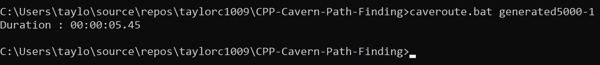

# Cavern Path Finding
An Artificial Intelligence project given by Edinburgh Napier University to find a pathway through a cavern with N amount paths.

This application utilizes the A* search algorithm to find the best possible path through a series of caverns, each of which have their own (x, y) coordinates.

The Makefile will help you use the application, and its commands are:
* `compile` compiles the application using the Windows C/C++ compiler,
* `clean` removes any files from the directory that were generated by the compiler or the appllication,
* `navigate cav=generatedX-X` executes the application using the Batch file with a caverns file (.cav file name to search from /cavs) as a parameter.

Final execution time of navigating 5000 caverns (of course, lower PC specs may give a different result):
   

## Here's some information I was given in the coursework specification:
* .cav files are text files which contain a series of integers, separated by commas.
* The first integer gives the number of caverns - N.
* The next N*2 integers give the coordinates of each of the caverns � each value is non-negative.
* The final N*N integers give the connectivity of the tunnels. 1 means connected, 0 means not connected. Remember that some tunnels are one-way.
* You must always start at the first cavern in the input file and end at the last cavern in the input file, where a route has been found. The first number will always be 1 and the last number will always be the ID of the last cavern.
* The solution program can be written in a language of your choice, but it must run on the command line and be accessible by the .bat file.

### Solutions I was given to some of the .cav files prior to starting the project:
* __(file)__
	* __(best path)__
	* __(distance of path from start to finish)__

* generated30-1
	* 1 7 12 13 14 19 23 29 30
	* 56.71

* generated100-1
	* 1 11 13 22 32 33 54 44 56 66 76 78 88 98 100
	* 47.94

* generated500-1
	* 1 25 48 71 116 161 183 228 251 295 318 363 408 431 453 499 500
	* 624.44

* generated500-2
	* 1 137 296 500
	* 586.15

* generated500-3
	* No Path
	* N/A

* generated1000-1
	* 1 32 63 64 95 126 157 156 187 218 249 250 281 282 314 345 346 347 378 409 440 471 502 532 563 564 595 626 657 656 655 686 717 747 746 777 778 809 839 840 841 872 903 934 935 936 967 968 969 1000
	* 794.52

* generated1000-2
	* No path
	* N/A

* generated1000-3
	* No path
	* N/A

* generated1000-4
	* No path
	* N/A
